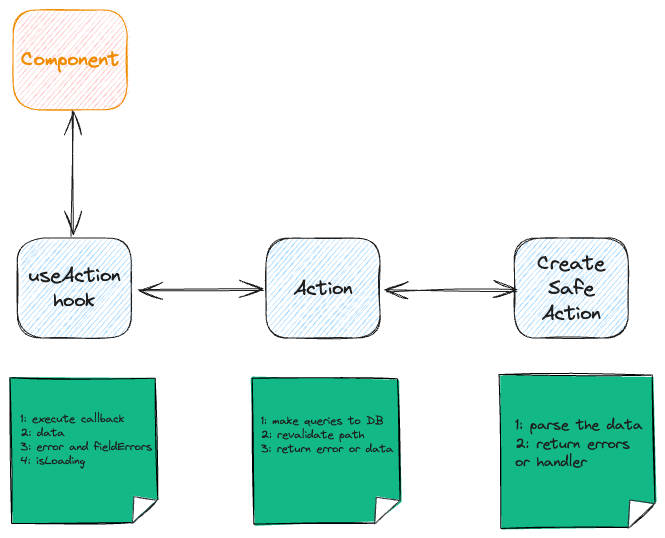

# Fullstack Trello Clone

This project is developed with Next.js 14., Server Actions, React, Prisma, Stripe, Tailwind, and MySQL.

Following the tutorial by [CodeWithAntonio](https://www.youtube.com/watch?v=pRybm9lXW2c&ab_channel=CodeWithAntonio).

## Getting Started

First, rename `.env.local.example` to `.env.local` and fill in the values.

Then run the development server:

```bash
npm run dev
```

## Docker mySQL

To run the mySQL database in a Docker container, run:

```bash
docker build -t mi-mysql-trello .
docker run --name mi-mysql-container -p 3306:3306 -d mi-mysql-trello
```

To access the database, first get the container ID:

```bash
docker ps
```

Then use the container ID and the mySQL user to access the database:

```bash
docker exec -it CONTAINER_ID mysql -u MYSQL_USER -p
```

Finally, access the database and show the tables:

```bash
USE trello;
SHOW TABLES;
```

## Prisma

### What is Prisma?

[Prisma](https://www.prisma.io/) is an open source next-generation ORM. It consists of the following parts:

- Prisma Client: an auto-generated and type-safe query builder that's tailored to your database schema.
- Prisma Migrate: a declarative data modeling and migrations system.
- Prisma Studio: a visual GUI for viewing and editing data in your database.

### Prisma Scripts

To access the Prisma Studio, run:

```bash
npm run prisma:studio
```

To generate assets for Prisma Client, run:

```bash
npm run prisma:generate
```

To update the database schema, run:

```bash
npm run prisma:push
```

To reset the database, run:

```bash
npm run prisma:reset
```

### How are work the actions?


